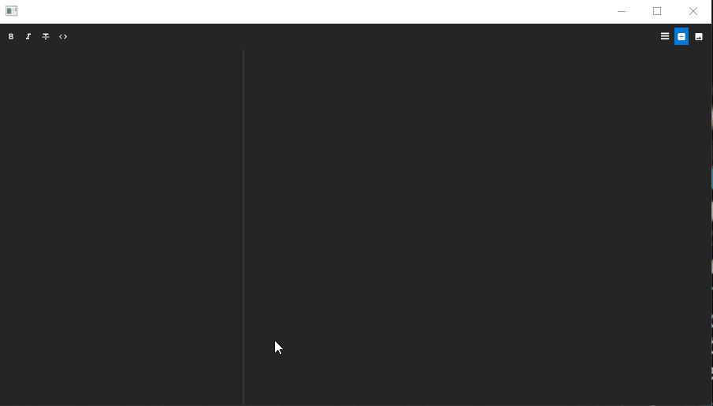
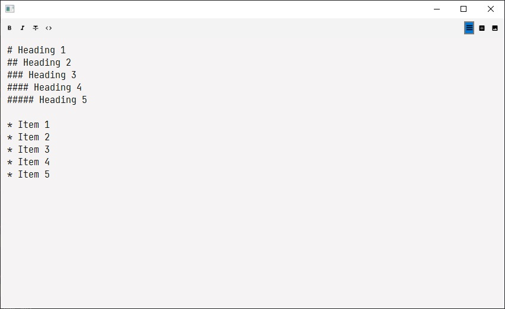
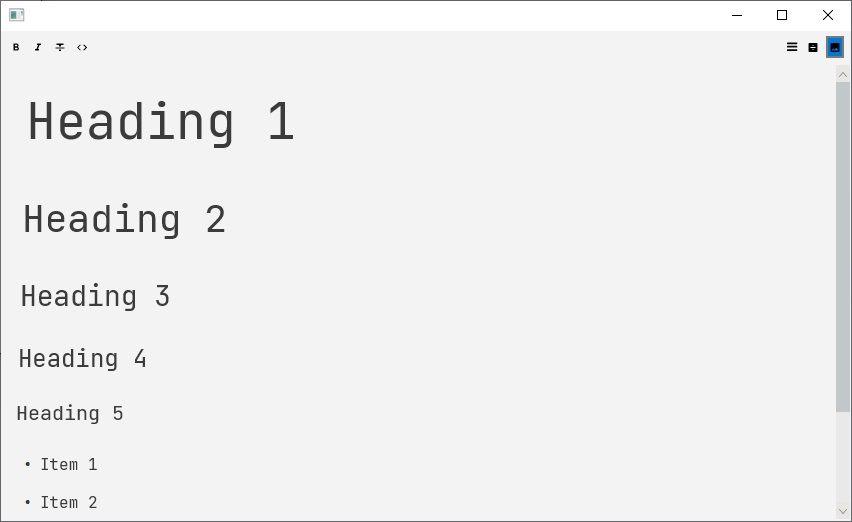
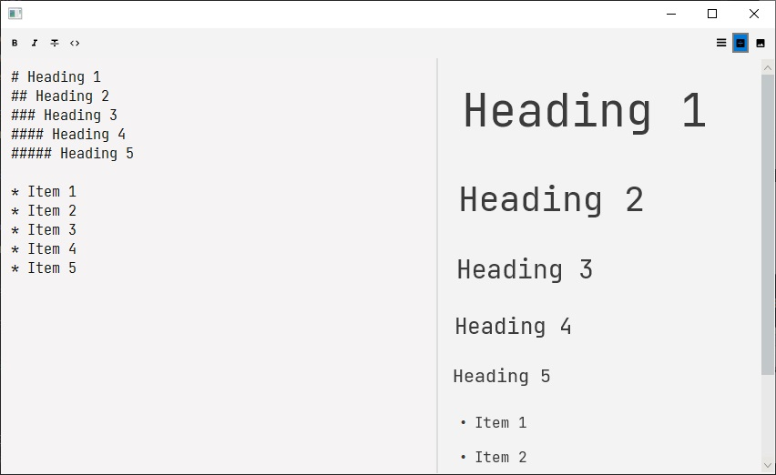

# MarkdownEditorControlFX


[](https://jitpack.io/#Dansoftowner/MarkdownEditorControlFX)


**An advanced markdown-editor control for JavaFX.**



# Features

* Three **view modes** : `EDITOR_ONLY`, `PREVIEW_ONLY`, `BOTH`
* Formatting toolbar items: `bold`, `italic`, `strikethrough`, `monospaced`
* Live preview
* Styleable through `JavaFX CSS`
* ...and more

### TODO
* Syntax highlighting in the `editor-area`
* Internationalization support
* Find dialog

Contributions are welcome!

# Requirements
Java 11 or higher

# Download

#### Maven example

```xml
<repositories>
		<repository>
		    <id>jitpack.io</id>
		    <url>https://jitpack.io</url>
		</repository>
</repositories>
```

```xml
<dependency>
	    <groupId>com.github.Dansoftowner</groupId>
	    <artifactId>MarkdownEditorControlFX</artifactId>
	    <version>0.6.3</version>
</dependency>
```

#### Gradle example
```groovy
repositories {
	...
    // For MarkdownEditorControl
    maven { url 'https://jitpack.io' }
    
    // For some of it's dependencies
    maven { url "http://sandec.bintray.com/repo"}
    maven { url "https://dl.bintray.com/jerady/maven" }
}
```

```groovy
dependencies {
	implementation 'com.github.Dansoftowner:MarkdownEditorControlFX:0.6.3'
}
```

# View modes

As mentioned, the control supports multiple view modes.  
Each view mode is represented by the enum: `com.dansoftware.mdeditor.MarkdownEditorControl.ViewMode`.  
It can be set using the `MarkdownEditorControl#setViewMode` method.

### 1. Editor only (`ViewMode.EDITOR_ONLY`)
In this mode, only the editor-area is visible.




### 2. Preview only (`ViewMode.PREVIEW_ONLY`)
In this mode, only the preview-area is visible.



### 3. Editor and preview (`ViewMode.BOTH`)



# Basic usage

```java
MarkdownEditorControl control = new MarkdownEditorControl();
control.setToolbarVisible(true); // setting the toolbar visible on the top
control.setMarkdown("# Default "); // setting an initial text

// ...add it to your container or whatever
container.getChildren().add(control);
```

# Demos

* [LightDemo](src/test/java/com/dansoftware/mdeditor/test/LightDemo.java) - Light-style example
* [DarkDemo](src/test/java/com/dansoftware/mdeditor/test/DarkDemo.java) - Dark-style example

# Used libraries

* [markdown-javafx-renderer](https://github.com/JPro-one/markdown-javafx-renderer) - JavaFX markdown renderer based on [flexmark](https://github.com/vsch/flexmark-java)
* [RichTextFX](https://github.com/FXMisc/RichTextFX) - Rich-text area for JavaFX
* [FontAwesomeFX](https://bitbucket.org/Jerady/fontawesomefx/src/master/) - for the icons

Used libraries for the demos:
* [JMetro](https://www.pixelduke.com/java-javafx-theme-jmetro/)

# Feedback
If you use this library in your project, let me know in the [discussions](https://github.com/Dansoftowner/MarkdownEditorControlFX/discussions)!

# License
**Apache 2.0**
